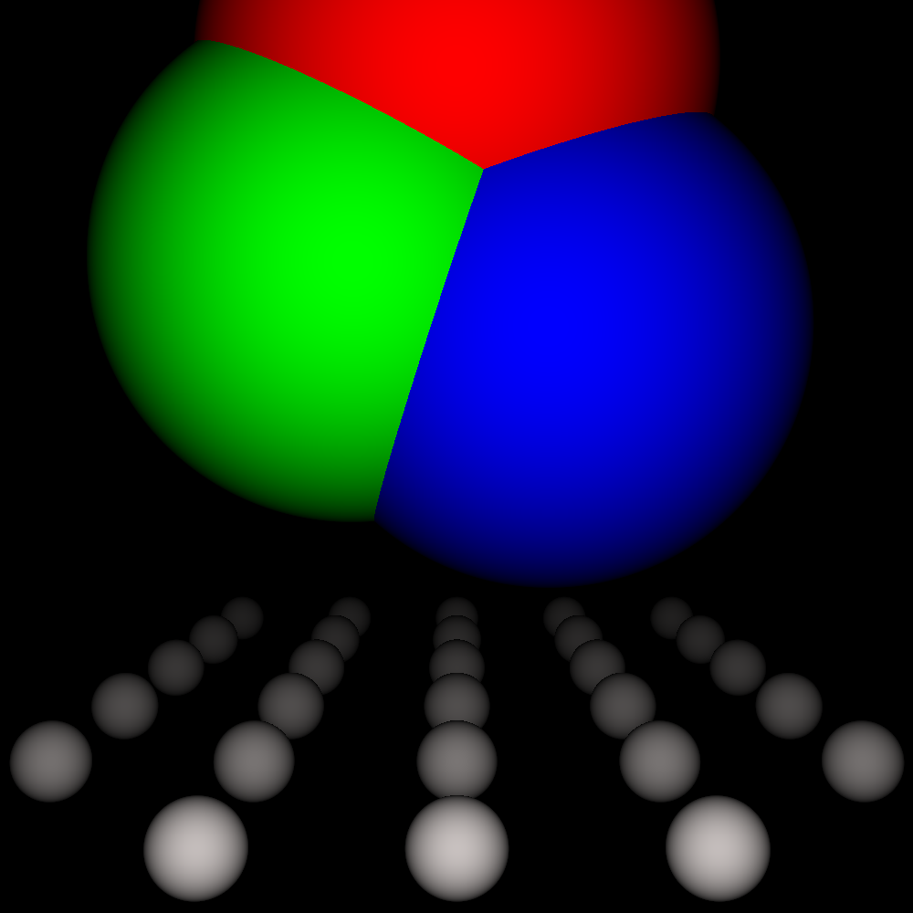

# Simple Raytracer

> A simple raytracer written in C++

## Show me a sample image!

## Quickstart

Run `make`, and `./simple-raytracer` to generate a `x.ppm` file, and look at it through, for example `eog`

## Not-so-quick start

Read `simple-raytracer.cpp`, then make changes (if any), then do steps in quickstart

## License

[Unlicense](LICENSE)
